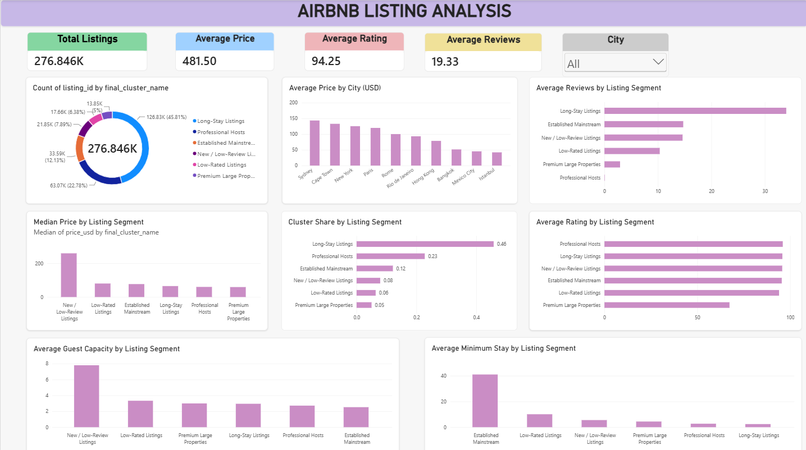

# Airbnb Listing Segmentation & Pricing Analysis

An end-to-end data analytics and machine learning project that analyzes Airbnb listings and review activity across multiple international cities, standardizes pricing information, segments listings using K-Means clustering, and presents the results through an interactive Power BI dashboard.

The project combines **SQL Server, Python, Scikit-learn, and Power BI** to build a complete analytical workflow from raw data preparation to machine-learning-based segmentation and business reporting.

---

## 📊 Dashboard



The Power BI dashboard provides an interactive view of:

- Listing distribution across segments
- Average price by city in USD
- Median price by listing segment
- Average reviews by segment
- Average rating by segment
- Guest capacity by segment
- Minimum stay requirements
- City-level filtering
- Segment-level comparison

---

## 🎯 Project Overview

Airbnb listings can differ significantly in terms of pricing, property size, guest capacity, minimum stay requirements, review activity, ratings, and host characteristics.

The dataset also contains listings from multiple cities using different local currencies. Therefore, directly comparing raw prices across cities can produce misleading conclusions.

This project addresses these challenges by:

1. Performing data-quality validation.
2. Exploring listing and review characteristics.
3. Standardizing prices into USD for cross-city reporting.
4. Creating a city-relative pricing feature for machine learning.
5. Engineering features related to listings, reviews, properties, and hosts.
6. Applying K-Means clustering to segment Airbnb listings.
7. Profiling and interpreting the resulting segments.
8. Loading the final analytical dataset back into SQL Server.
9. Building an interactive Power BI dashboard.

---

# 🎯 Objectives

The main objectives of this project are:

- Analyze Airbnb listing characteristics across multiple cities.
- Validate and clean the raw listing and review data.
- Identify pricing patterns and extreme-price listings.
- Standardize prices for cross-city comparison.
- Develop a city-relative pricing measure.
- Identify meaningful listing segments using unsupervised machine learning.
- Profile the characteristics of each segment.
- Build a reusable analytical dataset in SQL Server.
- Create an interactive Power BI dashboard for business analysis.

---

# 🗂️ Dataset

The project uses two primary datasets.

## Listings Dataset

The listings dataset contains approximately **279,712 listings** and includes information related to:

- Listing information
- Host information
- Host verification
- Host response and acceptance rates
- Location
- Property type
- Room type
- Guest capacity
- Bedrooms
- Pricing
- Minimum and maximum nights
- Review scores
- Booking characteristics

## Reviews Dataset

The reviews dataset contains approximately **5.37 million review records**.

Relevant fields include:

- Listing ID
- Review ID
- Review date
- Reviewer ID

### Raw Data Availability

The original raw `Listings.csv` and `Reviews.csv` files are not included in this repository because of their large size.

The project does include the final analytical clustering dataset:

# 🛠️ Technology Stack

| Category | Technology |
|---|---|
| Database | Microsoft SQL Server |
| Programming Language | Python |
| Data Processing | Pandas, NumPy |
| Machine Learning | Scikit-learn |
| Clustering | K-Means |
| Visualization | Matplotlib, Seaborn |
| Business Intelligence | Microsoft Power BI |
| Version Control | Git & GitHub |
| Notebook Environment | Jupyter Notebook |

---

# 🏗️ Project Architecture

The project follows a structured data-to-insight pipeline:

~~~text
Raw Airbnb Data
       │
       ▼
SQL Server Import
       │
       ▼
Data Quality Checks
       │
       ▼
Price Normalization
       │
       ▼
Exploratory Data Analysis
       │
       ▼
Analytical SQL View
       │
       ▼
Python Feature Engineering
       │
       ▼
Feature Scaling
       │
       ▼
K-Means Clustering
       │
       ▼
Cluster Profiling
       │
       ▼
Final Cluster Dataset
       │
       ▼
SQL Final Table
       │
       ▼
Dashboard Views
       │
       ▼
Power BI
~~~

---

# 📊 Dataset

The project uses Airbnb listings and reviews data covering multiple international cities.

## Listings Dataset

The listings dataset contains approximately **279,712 listings** and includes information related to:

- Listing information
- Host information
- Host verification
- Host response and acceptance rates
- Location
- Property type
- Room type
- Guest capacity
- Bedrooms
- Pricing
- Minimum and maximum nights
- Review scores
- Booking characteristics

## Reviews Dataset

The reviews dataset contains approximately **5.37 million review records**.

Relevant fields include:

- Listing ID
- Review ID
- Review date
- Reviewer ID

### Raw Data Availability

The original `Listings.csv` and `Reviews.csv` files are not included in this repository because of their large size.

The project does include the final analytical clustering dataset.

---

# 🧹 Data Quality & Preparation

Several data-quality checks were performed before modeling.

The analysis included validation of:

- Duplicate listing IDs
- Duplicate review IDs
- Composite review uniqueness
- Missing values
- Invalid or non-positive prices
- Listings with and without reviews
- Orphan review records
- Extreme pricing values

### Review Uniqueness

Review IDs are not treated as globally unique because the same review ID can occur across different listings.

The composite key:

~~~text
(listing_id, review_id)
~~~

was used when validating review uniqueness.

---

# 💰 Price Normalization

Because the dataset contains listings from different cities with different local currencies, raw prices are not directly comparable across cities.

The project therefore maintains three pricing concepts.

## 1. Raw Price

~~~text
price
~~~

This represents the original listing price in its local currency.

The original value is preserved rather than overwritten.

---

## 2. Standardized USD Price

~~~text
price_usd
~~~

This field is used for:

- Cross-city price comparisons
- Power BI reporting
- Dashboard price metrics
- Standardized presentation

The conversion uses **2021 annual average exchange rates**.

This is intended as an analytical standardization rather than an exact historical exchange-rate conversion for each listing date.

The production conversion is implemented in:

~~~text
sql/03_Price_Normalization.sql
~~~

---

## 3. Relative City Price

~~~text
price_vs_city_median
~~~

Calculated as:

~~~text
price_vs_city_median =
listing_price / city_median_price
~~~

This measures how expensive a listing is relative to the typical listing within its own city.

For example:

~~~text
1.00  → approximately city median
1.50  → 50% above city median
0.75  → 25% below city median
~~~

This feature is particularly useful for clustering because local price levels vary significantly between cities.

---

# 🔎 Exploratory Data Analysis

The exploratory analysis examines:

- Dataset structure
- Missing values
- Duplicate records
- Listing characteristics
- Price distributions
- Review activity
- Property types
- Room types
- Host characteristics
- City-level patterns
- Extreme pricing

The raw price distribution is highly skewed, with a relatively small number of listings having extremely high prices.

Because prices are represented in different local currencies, raw prices are treated as local-market values rather than directly comparable international prices.

---

# 🚨 Price Outlier Treatment

The analytical SQL layer identifies extreme prices using the **99th percentile of price within each city**.

Listings above their city's 99th percentile are classified as extreme-price listings.

This approach is preferable to applying one global price threshold because Airbnb pricing varies substantially between cities.

The clustering population excludes these extreme-price listings to prevent unusually expensive listings from dominating the clustering process.

---

# 🤖 Machine Learning

## Clustering Algorithm

The project uses **K-Means clustering**, an unsupervised machine-learning algorithm, to identify groups of Airbnb listings with similar characteristics.

The objective is to identify meaningful listing segments based on:

- Pricing position
- Property size
- Guest capacity
- Minimum stay requirements
- Review activity
- Guest ratings
- Host portfolio size

---

# 🧩 Feature Engineering

The final clustering model uses the following features:

~~~text
price_vs_city_median
accommodates
bedrooms
minimum_nights_log
review_scores_rating
total_reviews_log
host_total_listings_count_log
rating_missing
~~~

## Feature Description

| Feature | Description |
|---|---|
| `price_vs_city_median` | Listing price relative to the median price in its city |
| `accommodates` | Number of guests the listing can accommodate |
| `bedrooms` | Number of bedrooms |
| `minimum_nights_log` | Log-transformed minimum stay requirement |
| `review_scores_rating` | Guest rating |
| `total_reviews_log` | Log-transformed review count |
| `host_total_listings_count_log` | Log-transformed host portfolio size |
| `rating_missing` | Indicates whether rating information is unavailable |

---

# 📐 Data Transformation

Several features have highly skewed distributions.

Log transformations were applied to:

~~~text
minimum_nights
total_reviews
host_total_listings_count
~~~

using a log transformation equivalent to:

~~~python
np.log1p(x)
~~~

This reduces the influence of extreme values and makes the resulting features more suitable for clustering.

Missing values were handled using median imputation where appropriate.

A separate:

~~~text
rating_missing
~~~

indicator was retained to preserve information about missing rating data.

---

# ⚖️ Feature Scaling

Before applying K-Means, the clustering features were standardized using:

~~~text
StandardScaler
~~~

This ensures that features with larger numerical ranges do not disproportionately influence the clustering algorithm.

---

# 📊 Selecting the Number of Clusters

Different values of K were evaluated using:

- Elbow method
- Silhouette score
- Cluster interpretability

The final model uses:

~~~text
K = 6
~~~

with a final silhouette score of:

~~~text
0.3031
~~~

The six-cluster solution provided a useful balance between cluster separation and interpretability for this analysis.

---

# 🏷️ Final Listing Segments

The final K-Means model produced six analytical listing segments.

| Cluster | Segment |
|---:|---|
| 0 | Long-Stay Listings |
| 1 | New / Low-Review Listings |
| 2 | Established Mainstream |
| 3 | Professional Hosts |
| 4 | Low-Rated Listings |
| 5 | Premium Large Properties |

---

# 📈 Cluster Distribution

The final analytical population contains:

**276,846 listings**

| Segment | Listings | Share |
|---|---:|---:|
| New / Low-Review Listings | 132,747 | 47.95% |
| Established Mainstream | 63,060 | 22.78% |
| Long-Stay Listings | 33,868 | 12.23% |
| Low-Rated Listings | 22,232 | 8.03% |
| Professional Hosts | 18,535 | 6.70% |
| Premium Large Properties | 6,404 | 2.31% |
| **Total** | **276,846** | **100%** |

---

# 🔍 Cluster Interpretation

## 1. New / Low-Review Listings

This segment represents listings with relatively limited review activity and/or missing rating information.

It forms the largest segment of the analyzed population.

---

## 2. Established Mainstream

This segment represents listings with established review activity and more typical market characteristics.

It represents a substantial portion of the overall listing population.

---

## 3. Long-Stay Listings

This segment is primarily distinguished by relatively high minimum-night requirements.

These listings represent a smaller but clearly identifiable stay-duration segment.

---

## 4. Low-Rated Listings

This segment is characterized by comparatively lower guest rating values.

The segment can be used to identify listings with relatively weaker guest-rating performance.

---

## 5. Professional Hosts

This segment is associated with hosts managing larger numbers of listings.

The cluster provides an analytical view of listings associated with larger host portfolios.

---

## 6. Premium Large Properties

This segment is characterized by larger guest capacity and relatively premium positioning within its local market.

It represents the smallest of the six segments.

---

# 🌍 City-Level Analysis

The analysis covers multiple international cities, allowing the project to examine differences in:

- Pricing
- Property types
- Room types
- Guest capacity
- Review activity
- Host characteristics

Some notable dominant city and room-type patterns observed in the final segments include:

| Segment | Dominant City | Dominant Room Type |
|---|---|---|
| Established Mainstream | Paris | Entire place |
| New / Low-Review Listings | Paris | Entire place |
| Long-Stay Listings | New York | Entire place |
| Premium Large Properties | Sydney | Entire place |
| Professional Hosts | Paris | Entire place |
| Low-Rated Listings | Paris | Entire place |

These are descriptive patterns within the analyzed dataset and do not represent official Airbnb classifications.

---

# 📊 Power BI Dashboard

The final results are presented through an interactive Power BI dashboard.

## Dashboard Components

### KPI Cards

- Total Listings
- Average Price (USD)
- Average Rating
- Average Reviews

### Filters

- City

### Visualizations

- Listing Distribution by Segment
- Average Price by City (USD)
- Median Price by Listing Segment (USD)
- Average Reviews by Listing Segment
- Cluster Share by Listing Segment
- Average Rating by Listing Segment
- Average Guest Capacity by Listing Segment
- Average Minimum Stay by Listing Segment
- Average Price Relative to City Median

---

# 📌 Dashboard Metric Design

Different price fields are used depending on the analytical purpose.

| Analytical Purpose | Field |
|---|---|
| Cross-city price comparison | `price_usd` |
| Dashboard price reporting | `price_usd` |
| Within-city price positioning | `price_vs_city_median` |
| Original local price | `price` |

This prevents raw local-currency prices from being incorrectly compared across different markets.

---

# 🗄️ SQL Architecture

The SQL workflow is divided into separate stages.

~~~text
01_Data_Import.sql
        ↓
02_Data_Quality_Checks.sql
        ↓
03_Price_Normalization.sql
        ↓
04_Exploratory_Analysis.sql
        ↓
05_Analytical_View.sql
        ↓
Python Clustering
        ↓
06_Final_Cluster_Table.sql
        ↓
07_Dashboard_Views.sql
~~~

### SQL Files

| File | Purpose |
|---|---|
| `01_Data_Import.sql` | Imports raw CSV data into SQL Server |
| `02_Data_Quality_Checks.sql` | Performs data validation and quality checks |
| `03_Price_Normalization.sql` | Creates standardized USD pricing |
| `04_Exploratory_Analysis.sql` | Performs SQL-based exploratory analysis |
| `05_Analytical_View.sql` | Creates the analytical dataset and derived features |
| `06_Final_Cluster_Table.sql` | Loads Python clustering results into SQL Server |
| `07_Dashboard_Views.sql` | Creates Power BI-ready views |

---

# 📓 Python Notebooks

## `01_Airbnb_EDA.ipynb`

Contains exploratory analysis of the Airbnb listings and reviews data, including:

- Dataset inspection
- Data-quality checks
- Missing-value analysis
- Duplicate analysis
- Price distribution
- Review analysis
- Listing characteristics

## `02_Airbnb_Clustering.ipynb`

Contains the machine-learning workflow:

- Loading the analytical SQL view
- Feature selection
- Missing-value handling
- Feature engineering
- Log transformations
- Feature scaling
- K-Means evaluation
- Silhouette analysis
- Final clustering
- Cluster profiling
- Cluster naming
- Final dataset export

---

# 📁 Repository Structure

~~~text
Airbnb-Listing-Segmentation-Pricing-Analysis/
│
├── README.md
├── .gitignore
│
├── Data/
│   └── final_airbnb_clusters.csv
│
├── notebooks/
│   ├── 01_Airbnb_EDA.ipynb
│   └── 02_Airbnb_Clustering.ipynb
│
├── powerbi/
│   └── Dashboard.pbix
│
├── screenshots/
│   └── Dashboard.png
│
└── sql/
    ├── 01_Data_Import.sql
    ├── 02_Data_Quality_Checks.sql
    ├── 03_Price_Normalization.sql
    ├── 04_Exploratory_Analysis.sql
    ├── 05_Analytical_View.sql
    ├── 06_Final_Cluster_Table.sql
    └── 07_Dashboard_Views.sql
~~~

---

# 🚀 How to Reproduce the Project

## 1. Prepare the Raw Data

Obtain the original Airbnb listings and reviews datasets.

Place them in the location expected by the SQL import script.

The raw datasets are intentionally not included in this GitHub repository because of their size.

---

## 2. Set Up SQL Server

Create a database named:

~~~text
airbnb
~~~

Open SQL Server Management Studio and execute the SQL scripts in this order:

~~~text
01_Data_Import.sql
02_Data_Quality_Checks.sql
03_Price_Normalization.sql
04_Exploratory_Analysis.sql
05_Analytical_View.sql
~~~

---

## 3. Run the Python Analysis

Open:

~~~text
notebooks/02_Airbnb_Clustering.ipynb
~~~

Configure the SQL Server connection for your local environment.

Run the notebook to perform:

- Feature engineering
- Scaling
- K-Means clustering
- Cluster profiling

The notebook generates:

~~~text
Data/final_airbnb_clusters.csv
~~~

---

## 4. Load the Final Clusters

Execute:

~~~text
sql/06_Final_Cluster_Table.sql
~~~

This creates the final:

~~~text
dbo.AirbnbFinal
~~~

table in SQL Server.

---

## 5. Create Dashboard Views

Execute:

~~~text
sql/07_Dashboard_Views.sql
~~~

This creates the SQL views used by Power BI, including:

~~~text
vw_AirbnbDashboard
vw_ClusterSummary
vw_CitySummary
~~~

---

## 6. Open Power BI

Open:

~~~text
powerbi/Dashboard.pbix
~~~

Refresh the data model and interact with the dashboard.

---

# 📌 Key Analytical Findings

The clustering analysis identified six distinct analytical segments:

1. **New / Low-Review Listings**
2. **Established Mainstream**
3. **Long-Stay Listings**
4. **Low-Rated Listings**
5. **Professional Hosts**
6. **Premium Large Properties**

The largest segment is **New / Low-Review Listings**, containing approximately 48% of the final clustering population.

The smallest segment is **Premium Large Properties**, representing approximately 2.31% of the population.

The project also demonstrates that pricing should be interpreted differently depending on the analytical context:

- USD-standardized price is appropriate for cross-city reporting.
- City-relative price is more appropriate for comparing listings within their local markets.

---

# ⚠️ Limitations

Several limitations should be considered when interpreting the results.

### Currency Conversion

USD prices are based on 2021 annual average exchange rates rather than exchange rates corresponding to each listing date.

Therefore, `price_usd` should be considered a standardized analytical field rather than an exact historical transaction conversion.

### Clustering

K-Means clustering is sensitive to:

- Feature selection
- Feature scaling
- Number of clusters
- Data preprocessing

The resulting clusters are analytical segments rather than official Airbnb categories.

### Silhouette Score

The final silhouette score of **0.3031** indicates moderate cluster separation.

The clusters should therefore be interpreted as useful analytical groupings rather than perfectly separated natural categories.

### Dataset Coverage

The analysis is limited to the variables available in the supplied listings and reviews datasets.

Additional factors such as seasonality, booking availability, occupancy, local events, and demand patterns are not modeled.

---

# 🔮 Potential Future Improvements

Possible extensions include:

- Incorporating booking availability and occupancy data
- Adding seasonal pricing analysis
- Modeling demand by city
- Comparing cluster behavior across time
- Testing alternative clustering algorithms such as DBSCAN or Gaussian Mixture Models
- Using PCA for dimensionality analysis and visualization
- Building predictive models for listing price
- Developing a recommendation system for listing segments
- Adding automated data pipelines
- Connecting Power BI directly to refreshed analytical tables

---

# 💡 Skills Demonstrated

This project demonstrates practical experience in:

### SQL

- SQL Server
- CTEs
- Window functions
- Percentile calculations
- Aggregations
- Views
- Data validation
- Data transformation
- Analytical SQL

### Python

- Pandas
- NumPy
- Data preprocessing
- Feature engineering
- Statistical exploration
- Data visualization

### Machine Learning

- Unsupervised learning
- K-Means clustering
- Feature scaling
- Log transformations
- Elbow method
- Silhouette analysis
- Cluster profiling

### Business Intelligence

- Power BI
- KPI design
- Interactive filtering
- Segment analysis
- Cross-city analysis
- Dashboard design

### Data Engineering Workflow

- Raw data ingestion
- Data quality validation
- Transformation layers
- Analytical views
- ML output integration
- BI-ready data modeling

---

# 📚 Project Workflow Summary

~~~text
AIRBNB DATA
     │
     ▼
SQL DATA IMPORT
     │
     ▼
DATA QUALITY CHECKS
     │
     ▼
PRICE NORMALIZATION
     │
     ▼
EXPLORATORY ANALYSIS
     │
     ▼
ANALYTICAL SQL VIEW
     │
     ▼
PYTHON PROCESSING
     │
     ▼
FEATURE ENGINEERING
     │
     ▼
K-MEANS (K=6)
     │
     ▼
CLUSTER PROFILING
     │
     ▼
FINAL CLUSTER DATASET
     │
     ▼
SQL FINAL TABLE
     │
     ▼
POWER BI VIEWS
     │
     ▼
FINAL DASHBOARD
~~~

---

# 👤 Author

**Chetak Majhi**

B.Tech — Computer Science & Engineering (AIML)

Interested in:

- Data Analytics
- Machine Learning
- Software Engineering
- Data Science
- Artificial Intelligence

---

## ⭐ Project Summary

This project demonstrates an end-to-end approach to transforming a large, multi-city Airbnb dataset into actionable analytical segments.

The workflow integrates **SQL data engineering, exploratory analysis, feature engineering, unsupervised machine learning, and Power BI visualization** into a single reproducible analytics pipeline.
```text
